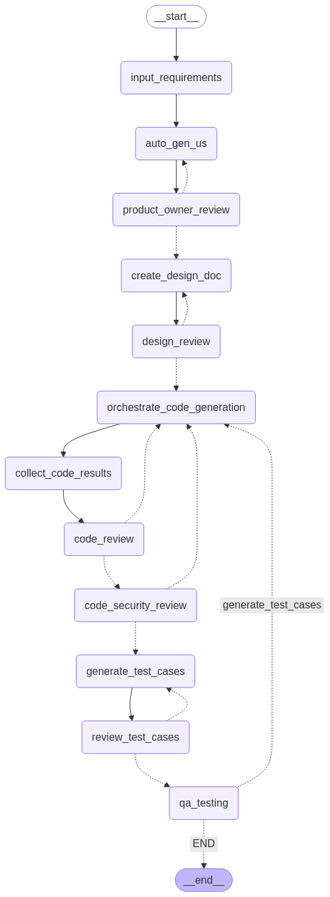

# AI-Powered SDLC Automation (CLI Version)

An intelligent assistant for automating the Software Development Life Cycle (SDLC), built for a hackathon challenge. This CLI tool guides a software project from requirement gathering to code generation using AI models, with structured feedback loops at each phase.

## 🚀 Features

- **Interactive Requirement Gathering**: Converts raw project inputs into structured user stories.
- **AI-Generated Design Documents**: Creates and revises system design documents based on user story feedback.
- **Code Generation**: Automatically generates production-level code and test cases.
- **Feedback Loops**: Human-in-the-loop feedback at each critical stage ensures accuracy and control.
- **Structured CLI Prompts**: Receive, revise, and approve outputs from the terminal interface.
- **Persistent Workflow State**: Ensures no phase is skipped and all feedback is incorporated before moving forward.

## 🧠 Tech Stack

- **Backend**: [LangGraph](https://github.com/langchain-ai/langgraph), 
               [Groq API](https://console.groq.com/) (LLM)
- **Language**: Python 3.10+
- **Interface**: Command-Line (CLI)


## 🛠️ How It Works

1. **Input Requirements** through CLI prompts.
2. AI generates **User Stories**.
3. CLI collects feedback or approvals.
4. On approval, the **Design Document** is generated.
5. Feedback loop continues for each phase.
6. Once approved, **Code & Test Cases** are generated.
7. Final outputs are saved locally.

## ✅ Requirements

- Python 3.10+
- `pip install -r requirements.txt`
- Groq API Key (for Qwen-2.5-Coder-32B or Gemma 2 9B IT)

## ⚙️ Setup & Run

```bash
# Clone the repo
git clone https://github.com/dipankar-programmer/sdlc_lifecycle.git
cd ai-sdlc-hackathon/src/SDLC_Project

# Install dependencies
pip install -r requirements.txt

# Run the CLI interface
python cli.py
```

All generated files (user stories, design documents, code, test cases) are saved in:

src/SDLC_Project/outputs/

💡 Future Improvements
Add support for PDF export of generated artifacts

Integrate with GitHub for auto-PR creation

Add role-based access and project history tracking

Replace CLI with GUI or web-based dashboard (Working on it)

🤝 Contributors
Your Dipankar